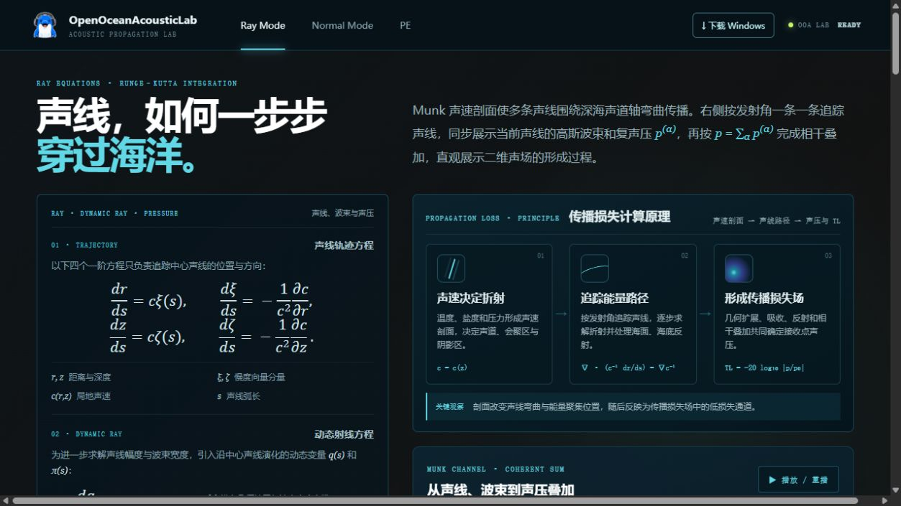
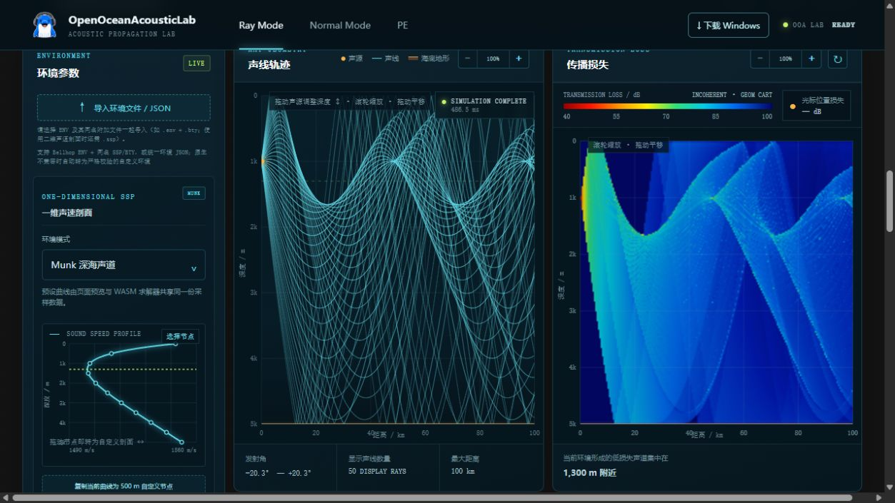
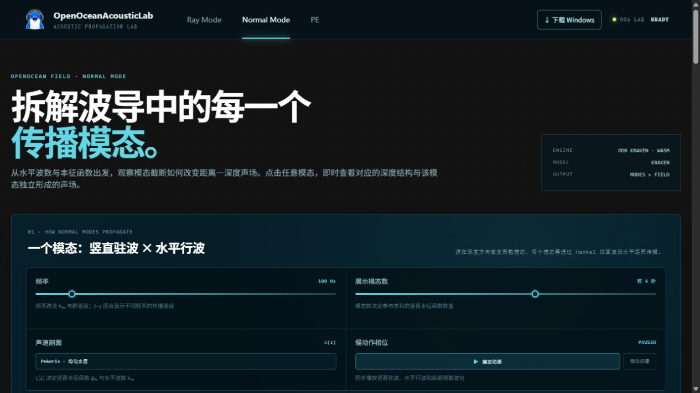
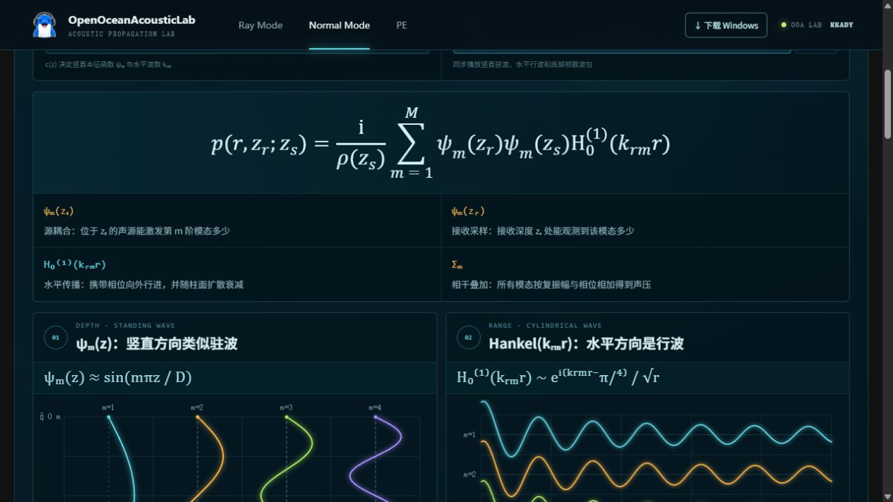
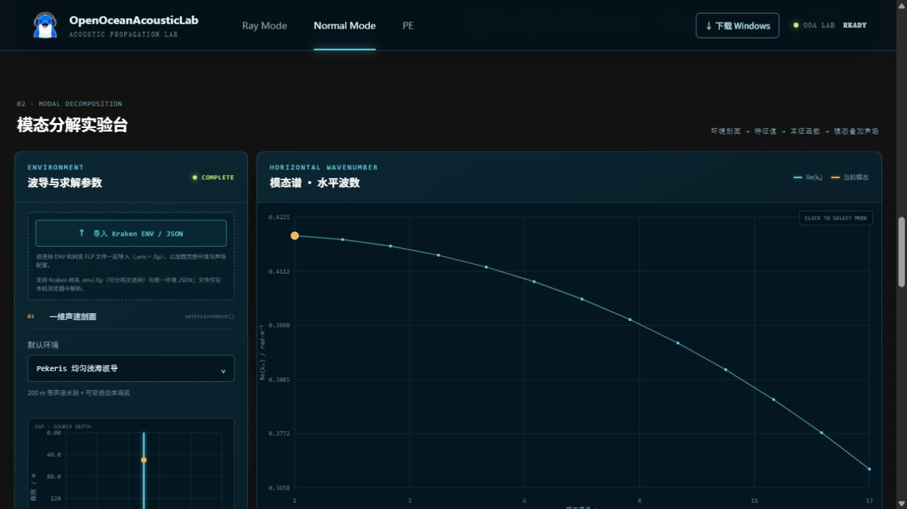
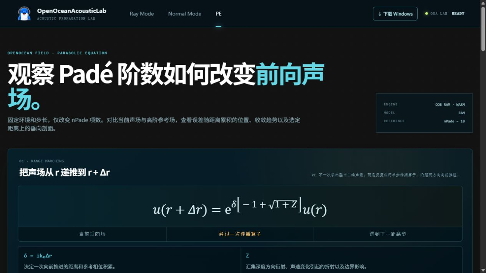
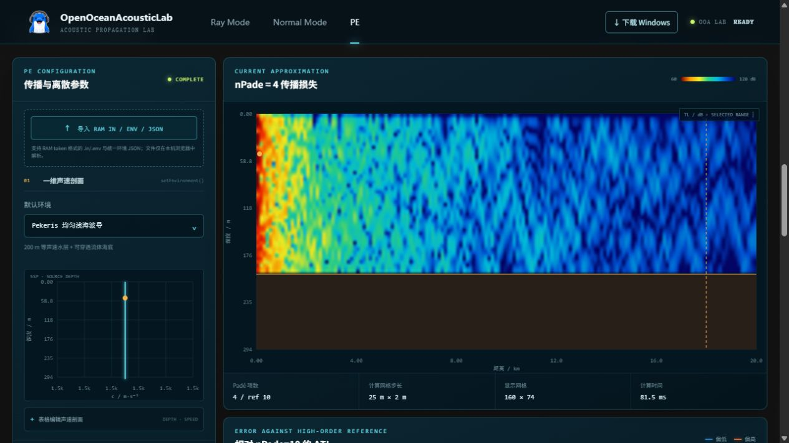

# OpenOceanAcousticLab 前端视觉审计

审计日期：2026-09-05。范围：首页 Ray Mode、/normal-mode/、/pe/。方法：浏览器真实截图，经视觉模型查看，并通过只读 DOM 测量 CSS 字号及页面尺寸。视口为 1280×720 CSS px。截图工具输出显示尺寸与 CSS 视口可能不同，字号以 DOM 实测为准。未修改网站、上传文件或人工触发计算。仅审计已查看的首屏与主要实验区，未完成手机、键盘、缩放及所有交互状态验证。

## 结论

深海色背景、青色强调、统一导航和科学图表形成了清晰的产品风格，值得保留。主要问题是展示性内容与操作性内容的尺度失衡：标题达到 54–64px，而必须阅读的导入说明、控件和提示只有 8–10px；图表很大，坐标与色标却很小。整改应先处理阅读障碍和页面溢出，再调整布局与装饰。

## 1. Ray Mode 首页

- **P1：整页横向溢出。** 截图底部出现横向滚动条；DOM 测得页面 scrollWidth 1294px，innerWidth 1280px。不能简单用 overflow-x:hidden 掩盖；应定位越界元素，检查网格子项最小宽度、长公式、固定宽度和间距累计。网格子项可使用 min-width:0，长公式采用局部滚动或合理换行。
- **P1：原理卡片说明偏小。** 三张“声速决定折射 / 追踪能量路径 / 形成传播损失场”卡片正文为 12px，行高 19.2px；路径概述为 11px；方程解释为 13px。建议重要说明 14–16px、行高 1.55–1.7，路径概述至少 12–13px。
- **P2：首屏优先级需要调整。** 主标题为 53.76px，导语 17px，本身可以读清；但长公式区和原理卡片将演示内容推到首屏下方。建议标题 40–48px，将交互预览或“进入实验台”入口放到标题附近，推导按章节展开。
- **P2：标签信息过多。** 多层全大写英文、小字编号、中文标题同时出现，增加扫读成本。英文分类标签保留一层，中文作为主层级。

- **P1：两张主图窄而高。** 在当前桌面宽度下，左参数栏与两张图形成三栏，图中距离方向受到压缩。建议参数栏可折叠；中等宽度优先保证主图可读宽度，必要时两图上下排列并保持同一距离轴，或用页签切换。
- **P1：坐标、图例、操作提示较难读。** 大面积绘图区并不能弥补微小的文字。建议图表刻度 12–14px、轴标题 13–14px、图例 12–14px；这些是建议值，未测得 Canvas 内文字的真实 CSS 字号。
- **P2：图内浮层占用数据区域。** 鼠标操作提示、计算完成提示位于图上方并遮住局部曲线。建议移到固定工具条，操作说明放帮助按钮，状态放图外。

## 2. Normal Mode

- **P1：控件文字过小。** “播放动画”“相位归零”实测 9px，滑块说明 10px。建议按钮 14px，说明 13–14px，当前频率和模态数 14–16px。
- **P1：导入条件不可弱化。** 实验台要求 ENV 与同名 FLP 配合，说明实测仅 8px，行高 12.4px。这属于操作必需信息，建议 13–14px，并将“请选择同名 .env 与 .flp”作为明确提示。
- **P2：大标题与空白占比过高。** 标题 64px，行高 65.92px；右侧 ENGINE / MODEL / OUTPUT 小卡与左侧标题尺度差异明显。建议标题降到 40–48px，元信息改成一行摘要或按需展开；在首屏露出有意义的图表预览。

- **P2：公式区优先级过强。** 主公式本身清楚，但公式区占据较大高度，解释只有 13px。建议适当压缩公式容器上下留白，以解释文本与波形图构成教学主体；无需全站等比放大公式。

- **P1：曲线刻度、图例和点击提示偏小。** 模态谱图面积大，但读数与“CLICK TO SELECT MODE”提示细小，用户未必知道节点可点。建议图上方增加“点击节点查看该模态”的中文提示；选中节点除颜色外增加尺寸/描边，并展示阶数、水平波数和单位。
- **P2：参数区信息密度失衡。** 狭窄参数栏容纳导入框、嵌套分组、说明和图表，右侧单图占据大块空间。建议减少卡片嵌套，统一分组间距，并按基本环境、声源、海底、求解选项分组折叠。

## 3. PE

- **P1：标题断行破坏词组。** 64px 标题在当前宽度下把“前向声场”拆开，下一行仅剩“场。”。建议改成“观察 Padé 阶数\n如何改变前向声场”，或简化为“Padé 阶数如何影响声场”；同时使用响应式字号，避免给整句强制 nowrap。
- **P1：按钮、说明、参数标签偏小。** 播放按钮 9px；导入说明及示意动画限定说明 8px；中心频率、水深、距离步长、深度步长等标签 10px。建议按钮与字段标签 14px，输入值 14–16px，限定说明 13–14px。
- **P2：开发接口名称不应抢占操作区。** setEnvironment() 等文本只有 8px，也不帮助一般用户决定如何输入。建议放进“开发者说明”，让参数区保留中文分组与物理单位。

- **P1：色标太小。** 右上角颜色条及端点值难以快速判读。建议提供约 180–240px 的色标空间，显示 4–6 个可读刻度及 dB 单位；尺寸为建议，需按图宽自适应。
- **P1：声速剖面刻度格式丢失差异。** 左图横轴多个刻度均显示为“1.5k”，肉眼无法区分数值。建议改成足够精度的实际 m/s 数值，或相对参考声速的差值刻度；自适应格式须保证相邻不同刻度不被显示为同一个字符串。
- **P1：对照图距离过远。** DOM 测得当前 TL、误差场、收敛曲线、垂向剖面标题分别位于约 y=1656、2241、2826、3507px。建议让 TL 与 ΔTL 使用联动双图或保持视窗的切换方式，统一距离/深度范围，并联动选定距离；宽屏可并列，中等宽度避免强行挤成小图。
- **P2：海底区域占据显著空间但解释不足。** 当前图底部棕色区域应直接标注“海底介质”，可提供“水层 / 全计算域”视图切换；不要为了美观直接隐藏有物理意义的区域。
- **P2：颜色尺度需服务比较。** TL 使用连续、亮度变化较平滑的色标；有正负的 ΔTL 使用以零为中心的发散色标，并明确单位及范围。保留传统色标时应保证跨图比较的色标含义一致。

## 4. 建议统一的视觉规格

| 元素 | 当前实测或观察 | 建议 |
|---|---|---|
| 页面主标题 | Ray 53.76px；Normal / PE 64px | 当前桌面宽度 40–48px；更窄屏 28–36px |
| 章节标题 | Normal / PE 23px | 保持 22–24px |
| 卡片标题 | 15–20px | 16–20px，统一同层级 |
| 正文 | 12–17px，差异大 | 15–16px；行高 1.55–1.7 |
| 参数标签 | PE 多处 10px | 14px |
| 输入值 | 本次未逐项测量 | 14–16px，数值可用等宽数字 |
| 主要按钮 | 部分 9px | 14–16px；高度约 36–40px |
| 必要操作说明 | 最小 8px | 13–14px |
| 图表刻度/图例 | 视觉偏小，未逐项测量 | 12–14px |
| 装饰性英文标签 | 10–11px | 11–12px，只保留必要部分 |

字体建议：中文 UI 统一使用清晰的无衬线字体栈；等宽字体仅用于数值、标识符与代码；数学公式保留专业数学字体。正文不宜使用过细字重或额外字距；参数数字使用 tabular-nums，减少数值变化时跳动。当前字体栈包含 Inter、SF Pro Display、PingFang SC、Microsoft YaHei；实际命中的字体未进一步核验。

颜色与层级：保留深海背景与青色强调，提升重要说明的明度。对比度在本次仅作视觉判断，未完整计算，不能据此宣称通过或未通过某项无障碍标准。减少多重嵌套边框、泛光与全大写标签，以标题、间距和分隔线建立层级。不同图中相同物理意义的颜色应固定，选中状态同时依靠形状/描边表达。

布局建议：全站统一内容容器和左右边距；采用 8px 间距节奏，卡片内边距 16–24px、分组间距 16px、章节间距 32–48px。首屏提供“原理演示 / 实验台 / 结果对比”锚点。正常阅读模式可保留推导，实验模式应让参数与图表更快可达。

## 5. 整改顺序与验收

1. **第一批：阅读与排版缺陷。** 修复 Ray 横向溢出、PE 标题断词、8–10px 必要文字、图表/色标字号以及“1.5k”重复刻度。
2. **第二批：布局。** 缩短首屏，增加实验台直达入口；参数栏可折叠；PE 对照图联动；减少图内遮挡。
3. **第三批：统一样式。** 统一字体层级、间距、边框、数值格式、色标与状态呈现。

建议验收：1280×720、1440×900、1920×1080 下无整页横向滚动；窄屏若支持则另测 390px 宽布局；浏览器 200% 缩放时关键操作仍可达；按钮、输入值与必要说明无需放大即可读清；每幅图在原始显示大小下能读出轴名、单位、刻度、色标和当前选中状态。不要把“把所有文字放大”作为唯一修复，应同步调整卡片宽度、行距和信息密度。
